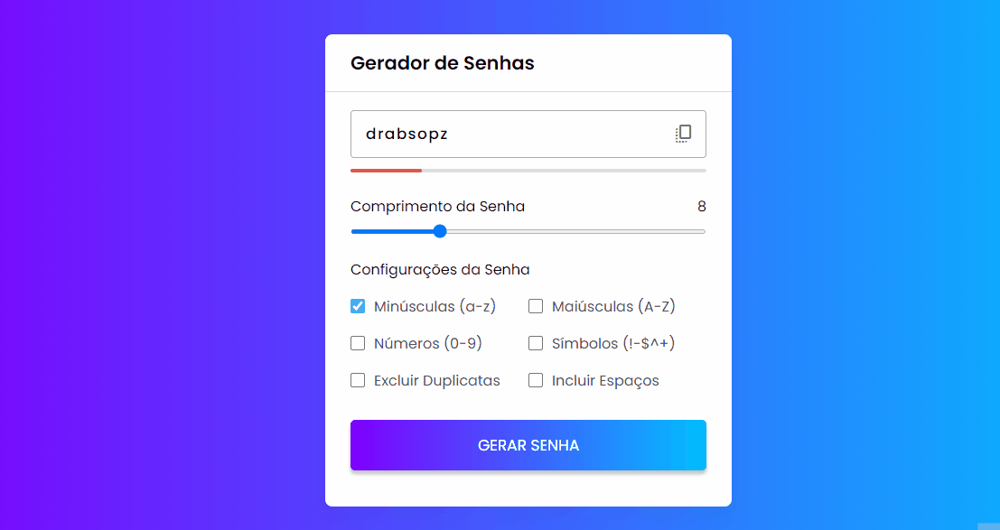

## 🧾 Descrição

Aplicação que permite aos usuários gerarem senhas aleatórias e seguras de acordo com as suas preferências. A aplicação permite que o usuário escolha o tamanho da senha e selecione os tipos de caracteres que serão utilizados, como letras maiúsculas, minúsculas, números e caracteres especiais. A aplicação é útil para garantir a segurança das senhas utilizadas em diversas plataformas, como redes sociais, contas bancárias, e-mails e outros serviços online.

<h1>

## 🔌 Tecnologias utilizadas

- **HTML:** linguagem de marcação usada para estruturar e apresentar o conteúdo da página;
- **CSS:** linguagem de estilo usada para estilizar a página, incluindo layout, fontes, cores, etc;
- **JavaScript:** Linguagem de programação que permite criar interações dinâmicas na web. Com ela é possível manipular o conteúdo HTML e CSS em tempo real, validar formulários, criar animações, entre outras possibilidades

## ⚙️ Estrutura

- **img:** Contém imagens utilizadas no projeto e para apresentação no Readme.md;
- **index.html:** Contém a linguagem de marcação usada para estruturar e apresentar o conteúdo da página;
- **style.css:** Contém regras de estilo que são usadas para personalizar a aparência da página HTML. Ele inclui configurações de fonte, cor de fundo, posicionamento e tamanho de elementos, e outras propriedades de estilo para tornar a página mais atraente e fácil de usar.
- **script.js:** É utilizado para selecionar o comprimento da senha e escolher diferentes tipos de caracteres a serem incluídos, como letras minúsculas, letras maiúsculas, números e símbolos. A senha gerada é exibida em uma caixa de texto e um indicador de força de senha é fornecido para mostrar a força da senha gerada. Função também para para copiar a senha gerada para a área de transferência. 

## 🏳️ Como executar?

### **Passo 1**
Faça download do repositório

### **Passo 2**
Abra o arquivo "Index.html" em um navegador e teste as funções.

 

## ✅ Resultado (Preview)

### **Gerador de senhas**

 

## 💻 Autor: Luan Ferreira

Portfólio:
- [Github](https://github.com/fluanbrito)

Contato:
- [Linkedin](https://www.linkedin.com/in/luanferreirab/)

<h1>

## 🚀 Sobre mim
Sou um grande entusiasta e apaixonado por tecnologia, empreendedorismo e inovação. Hoje, estou a cursar o curso de Sistema de Informação pelo Instituto Federal, faço uso profissionalmente de ferramentas e me aprofundo em temas como Marketing, Machine Learning AWS, Metodologias ágeis, Gestão de Projetos, Programação Web, Administração de Sistemas, Redes de computadores, entre outros.